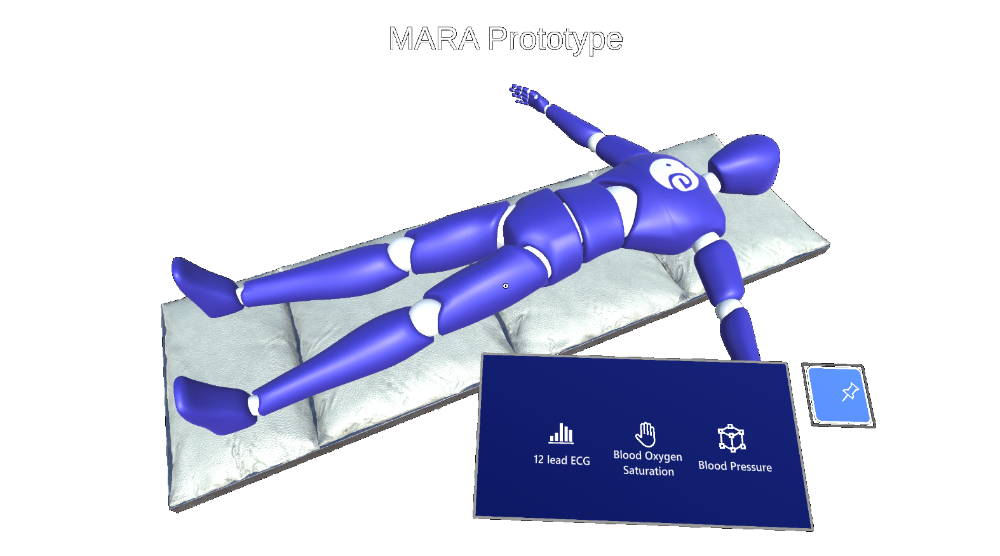
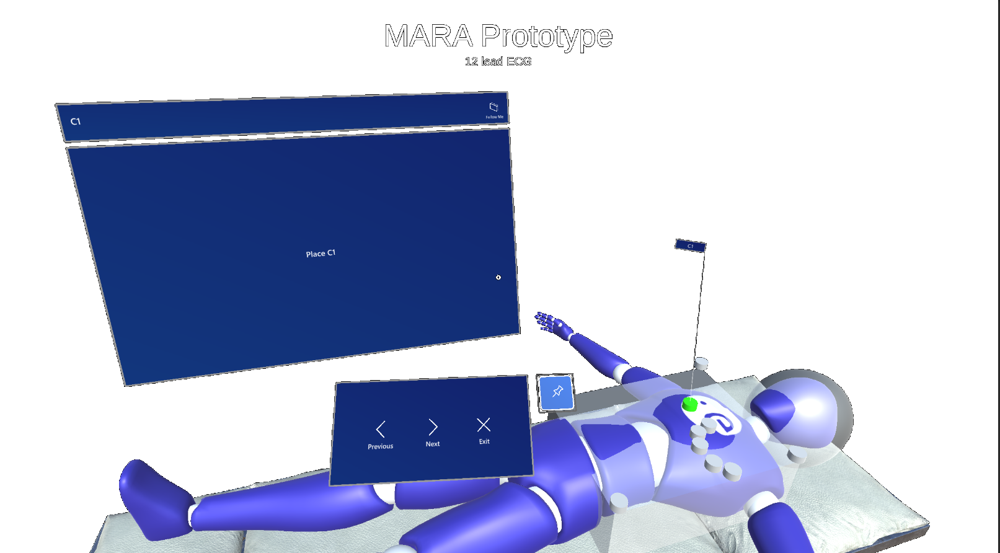
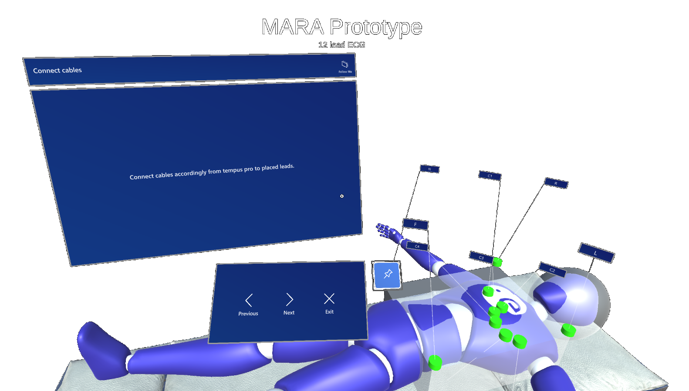

# MARA-Prototype
A prototype for the Medical Augmented Reality Assistant (MARA) as proposed by [ESA](https://esa.int/).

# Description
This AR application is being developed as a preparation for a YGT position at ESA and as a general practice for me to test out how the project could be approached.
The application is made in Unity and its target device is the [**Microsoft HoloLens**](https://www.microsoft.com/de-de/hololens). Its purpose is to walk its user through the basic steps of performing a **12-lead ECG** with the [**TEMPUS Pro  mobile vital signs monitor**](https://www.esa.int/ESA_Multimedia/Images/2020/04/Tempus_Pro_telemedicine_device). (The build has only been tested in the Unity environment and not directly on the targeted device.)

Building blocks from the [Microsoft Mixed Reality Toolkit (MRTK)](https://docs.microsoft.com/en-gb/windows/mixed-reality/mrtk-unity/packages/mrtk-packages?view=mrtkunity-2021-05) were used to speed up the prototyping process because the toolkit provides all the necessary functionality that was required to implement the  desired basic functionality.

The user is required to place a simple chest model in space (overlay on the patient) and can then follow through the procedure steps to place the chest leads for the ECG accordingly. The user is able to navigate through the steps via navigation buttons (for now).

The chest model is a simple cube and will eventually be replaced with a life-like model. Chest leads are only placed at their rough locations for the purpose of visualization/testing of this first prototype.

**This is just a prototype with VERY basic functionality and rudimentary visuals to serve as a training space for me, and to serve as a potential preview in case of an invitation to a second interview.**

# Preview
The following pictures show a preview of the basic setup. It is not pretty but the basic functionality is there and can be built upon / improved. :)

## Basic intro menu
Basic toolbar for choosing the required medical procedure. Placement of the toolbar can be locked in place or tag along with the user.

## Preview of displaying the placement of a single chest lead
Displaying the tooltip and the placement location for chest lead C1 with basic placeholder text on the instructions panel.

## Preview of displaying all placed chest leads
Displaying the tooltips and the placement locations of all chest leads and a basic placeholder text on the instructions panel.

# Coming improvements

## 12-lead ECG
- Visual improvements (e.g. size and placement of tooltips, menus/panels etc.)
- Replacement of simple chest model with life-like model
- Proper positioning of chest leads
- Automated chest positioning with the help of pose / object recognition
- Detailed step instructions (mostly just basic placeholders/descriptions for now)
- Gesture control for step navigation
- Voice control for step navigation
- User profiles including user settings for preferred UI positioning (Information Panel and Navigation Bar, as well as choice of controls (gesture, voice, buttons))
- Scoring system to evaluate users speed and correctness of performance for each procedure - report creation

## Blood Pressure Procedure
- Add instructions for a procedure for measuring the blood pressure with the TEMPUS Pro vital signs monitor

## Blood Oxygen Procedure
- Add instructions for a procedure for measuring the blood oxygen level with the TEMPUS Pro vital signs monitor

## Ultra Sound Procedure
- Add instructions for a procedure for performing an ultra sound with the TEMPUS Pro vital signs monitor (requires additional module for the TEMPUS Pro device)

# Further Ideas for Additions

## Defibrillation
Adding a step by step procedure for defibrillation with the use of TEMPUS ALS.

## Overlay of veins underneath the skin
Development of an additional module (that is compatible/can communicate with the HoloLens) that enables the detection of veins underneath the skin which can then be overlaid on the patients arm. This could help to reduce the risk of missing a vein or causing unnecessary damage and would simplify procedures like drawing blood or placing IV's. (See  to get an idea)
